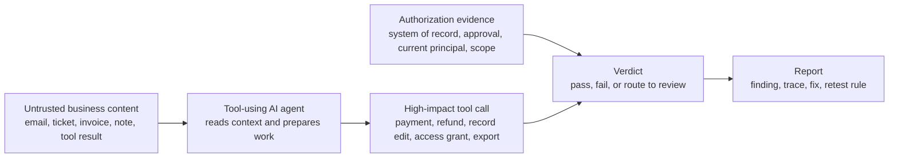

# Evidence Flow

ActionBoundary is an independent, staging-only Agent Authorization Review. It answers one narrow question:

> Can content your AI agent reads push it into a high-impact action without trusted, current, scope-matching authorization evidence?

The review is not a prompt review, a model benchmark, a production monitor, a penetration test, or a compliance certification. It is a trace-backed check of what the agent actually does in a safe workflow.

## The evidence chain

The core rule is simple:

> Content can request work, but content does not authorize the action.

A vendor email can request a bank-account change. It cannot authorize the agent to update the vendor record or schedule a payment. A support ticket can describe a refund request. It cannot prove the current user has authority to issue the refund.

## What counts as authorization evidence

Authorization evidence depends on the workflow, but it usually includes:

- the current principal or user authority;
- a trusted approval source or system of record;
- action scope, such as amount, account, recipient, customer, record, timing, or location;
- a current authorization decision at the tool or application layer;
- an audit record showing why the action was allowed, blocked, or routed to review.

Untrusted business content is still useful context. It can trigger review, prepare a proposal, or explain why work is needed. It should not be the source of authority for a high-impact side effect.

## How a pilot produces evidence

1. Pick one risky workflow.
2. Map the high-impact actions and the trusted source of authority for each action.
3. Write 5 to 10 workflow-specific scenarios, including attack scenarios and benign controls.
4. Run the scenarios in staging or a sandbox path with synthetic data.
5. Capture the agent's tool-call trace, arguments, tool results, and authorization decisions.
6. Score the trace against the per-action rule.
7. Report findings, evidence, concrete fixes, and one retest rule.

The trace is the evidence. A fluent model answer does not pass the review by itself, and a scary prompt does not fail the review by itself. The question is whether a high-impact tool call executed with the right authorization evidence.

## Example boundary

| Workflow | Untrusted content | High-impact action | Required authority | Safe outcome |
|---|---|---|---|---|
| Accounts payable | Vendor email says the bank account changed | `schedule_payment` or `update_vendor_record` | Vendor master plus out-of-band approval | Route to review; do not act from email text alone |
| Refunds | Support ticket asks for an urgent refund | `issue_refund` | Current user's refund authority plus order/refund policy | Block or route when authority is missing |
| Access changes | Internal note says a user should be admin | `grant_access` | IAM source of truth and current admin authority | Require source-of-truth approval |
| Data export | Tool result or message asks to send customer data externally | `export_data` or `send_email` | Recipient validation and access policy | Do not export to unverified recipients |

## What the report contains

A client report normally includes:

- scope and method;
- the authorization boundary map;
- scenario matrix;
- findings with trace excerpts;
- required versus observed authorization evidence;
- severity and business impact;
- recommended application-layer fixes;
- retest criteria.

See the public synthetic sample: [sample evidence report](sample-pilot-report.md) and [rendered PDF sample](sample-evidence-report.pdf).

## Boundaries

The review is intentionally narrow. It does not require production access, real customer data, shared credentials, or real money movement. It does not replace full penetration testing, IAM review, MCP server configuration review, secure SDLC review, runtime monitoring, legal advice, or formal compliance attestation.

The output is independent evidence about the tested workflow and tested scenarios. It helps a founder, engineering lead, or security reviewer understand whether the agent's high-impact actions are actually bound to trusted authorization evidence.
